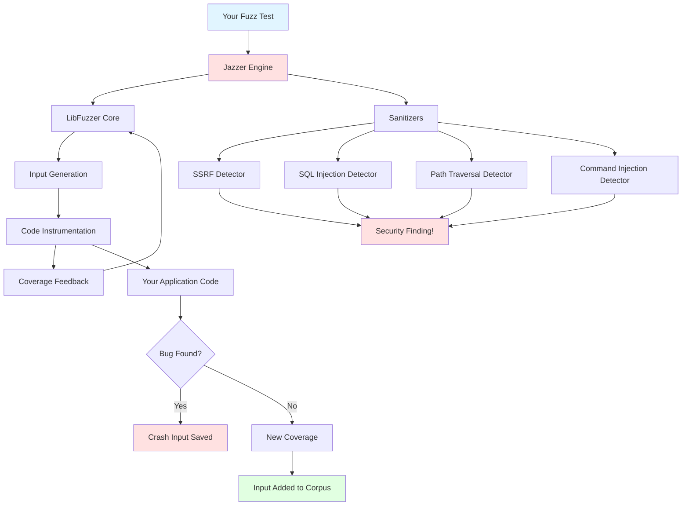
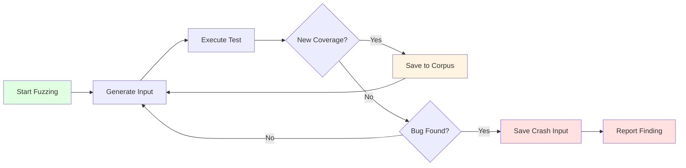

# 🎯 Jazzer Interactive Demo Showcase

<div align="center">

```
     ██╗ █████╗ ███████╗███████╗███████╗██████╗ 
     ██║██╔══██╗╚══███╔╝╚══███╔╝██╔════╝██╔══██╗
     ██║███████║  ███╔╝   ███╔╝ █████╗  ██████╔╝
██   ██║██╔══██║ ███╔╝   ███╔╝  ██╔══╝  ██╔══██╗
╚█████╔╝██║  ██║███████╗███████╗███████╗██║  ██║
 ╚════╝ ╚═╝  ╚═╝╚══════╝╚══════╝╚══════╝╚═╝  ╚═╝
```

**🚀 Coverage-Guided Fuzzing for the JVM**

[🏠 Home](../README.md) | [📚 Documentation](../docs) | [💡 Examples](#-live-examples) | [🎓 Tutorials](#-tutorials) | [🔧 Integrations](#-integrations)

</div>

---

## 📖 Welcome to the Jazzer Demo Hub!

This interactive showcase demonstrates **Jazzer's powerful fuzzing capabilities** for finding security vulnerabilities and bugs in Java applications. Explore real-world examples, hands-on tutorials, and ready-to-use integration templates.

### 🌟 What Makes Jazzer Special?

- **🎯 Intelligent Fuzzing**: Coverage-guided input generation finds bugs faster
- **🛡️ Security Sanitizers**: Built-in detectors for SSRF, SQL injection, path traversal, and more
- **🔄 JUnit Integration**: Write fuzz tests alongside your regular unit tests
- **📊 Real-time Feedback**: See coverage increase as Jazzer explores your code
- **🚀 Easy Setup**: Works with Maven, Gradle, and Bazel out of the box

---

## 🎪 Quick Navigation

### 💡 Live Examples
Explore working security vulnerability detection demos:

| Example | Vulnerability Type | Difficulty | Link |
|---------|-------------------|------------|------|
| 🗄️ SQL Injection | Database Security | ⭐⭐ | [View Demo](examples/sql-injection-demo/) |
| 📂 Path Traversal | File System Security | ⭐ | [View Demo](examples/path-traversal-demo/) |
| 🌐 SSRF Detection | Network Security | ⭐⭐⭐ | [View Demo](examples/ssrf-demo/) |
| ⚡ Command Injection | OS Security | ⭐⭐ | [View Demo](examples/command-injection-demo/) |
| 🔓 Deserialization | Object Security | ⭐⭐⭐ | [View Demo](examples/deserialization-demo/) |

### 🎓 Tutorials
Step-by-step guides to master Jazzer:

| Tutorial | Level | Duration | Link |
|----------|-------|----------|------|
| ⚡ Getting Started in 5 Minutes | Beginner | 5 min | [Start](tutorials/quickstart.md) |
| ✍️ Writing Your First Fuzz Test | Beginner | 15 min | [Start](tutorials/first-fuzz-test.md) |
| 🚀 Advanced Fuzzing Techniques | Advanced | 30 min | [Start](tutorials/advanced-techniques.md) |
| 🛡️ Sanitizer Configuration | Intermediate | 20 min | [Start](tutorials/sanitizer-guide.md) |

### 🔧 Integrations
Ready-to-use project templates:

- 📦 [Maven Project Template](integrations/maven-template/) - Complete Maven setup with examples
- 🐘 [Gradle Project Template](integrations/gradle-template/) - Gradle configuration and tasks
- 🔨 [Bazel Integration](integrations/bazel-template/) - Bazel rules and BUILD files
- 🔄 [GitHub Actions CI/CD](integrations/github-actions/) - Automated fuzzing in your pipeline

### 📊 Comparisons
See Jazzer in action against traditional testing:

- 🆚 [Traditional Testing vs Fuzzing](comparisons/traditional-vs-fuzzing/) - Side-by-side comparison
- 📈 [Coverage Metrics Comparison](comparisons/traditional-vs-fuzzing/coverage-comparison.md)
- 🐛 [Bug Detection Effectiveness](comparisons/traditional-vs-fuzzing/bug-detection-comparison.md)

---

## 🏗️ Architecture Overview



---

## 🚀 Quick Start

Get up and running with Jazzer in 60 seconds:

### 1️⃣ Add Dependency

**Maven:**
```xml
<dependency>
    <groupId>com.code-intelligence</groupId>
    <artifactId>jazzer-junit</artifactId>
    <version>0.24.0</version>
    <scope>test</scope>
</dependency>
```

**Gradle:**
```gradle
testImplementation 'com.code-intelligence:jazzer-junit:0.24.0'
```

### 2️⃣ Write Your First Fuzz Test

```java
import com.code_intelligence.jazzer.junit.FuzzTest;

class MyFuzzTest {
    @FuzzTest
    void fuzzJson(String input) {
        // Jazzer will generate diverse String inputs
        MyJsonParser.parse(input);
    }
}
```

### 3️⃣ Run It!

```bash
# Regression mode (run with known inputs)
mvn test

# Fuzzing mode (discover new bugs)
JAZZER_FUZZ=1 mvn test
```

---

## 🎨 Fuzzing Workflow



---

## 🏆 Trophy Case

Jazzer has found critical vulnerabilities in production software:

- 🔥 **CVE-2021-22569** - Denial of Service in Protocol Buffers
- 🔥 **CVE-2021-29425** - Path Traversal in Apache Commons IO
- 🔥 **CVE-2022-25647** - Denial of Service in Google Gson
- 🔥 **CVE-2022-42003** - Denial of Service in Jackson
- 🔥 **Multiple CVEs** in Apache Batik, PDFBox, and more

[View Full Trophy List](../docs/trophies.md) 🏆

---

## 📊 Why Fuzz Testing?

### Traditional Unit Testing
```java
@Test
void testValidInput() {
    assertEquals("hello", parser.parse("hello"));
}

@Test
void testEmptyInput() {
    assertEquals("", parser.parse(""));
}
// ❌ What about the millions of other inputs?
```

### Fuzzing with Jazzer
```java
@FuzzTest
void fuzzParser(String input) {
    // ✅ Jazzer tests millions of inputs automatically
    // ✅ Guided by coverage feedback
    // ✅ Finds edge cases you didn't think of
    parser.parse(input);
}
```

**Result:** Jazzer automatically generates test cases that maximize code coverage and trigger bugs!

---

## 🎯 Live Demo Commands

Try these commands right now in the `examples/` directory:

```bash
# 1. SQL Injection Detection
cd examples/sql-injection-demo
mvn test  # See how Jazzer detects SQL injection

# 2. Path Traversal Detection  
cd ../path-traversal-demo
JAZZER_FUZZ=1 mvn test  # Watch Jazzer find path traversal bugs

# 3. SSRF Detection
cd ../ssrf-demo
mvn test  # See Server-Side Request Forgery detection in action

# 4. Command Injection Detection
cd ../command-injection-demo
mvn test  # Watch command injection vulnerabilities get caught

# 5. Deserialization Vulnerability Detection
cd ../deserialization-demo
mvn test  # See unsafe deserialization detection
```

---

## 🎓 Learning Path

### For Beginners
1. 📖 Read [Getting Started in 5 Minutes](tutorials/quickstart.md)
2. 🔍 Try the [SQL Injection Demo](examples/sql-injection-demo/)
3. ✍️ Follow [Writing Your First Fuzz Test](tutorials/first-fuzz-test.md)

### For Intermediate Users
1. 🚀 Explore [Advanced Techniques](tutorials/advanced-techniques.md)
2. 🛡️ Master [Sanitizer Configuration](tutorials/sanitizer-guide.md)
3. 🔧 Set up your [CI/CD Pipeline](integrations/github-actions/)

### For Advanced Users
1. 📊 Study [Comparison Metrics](comparisons/traditional-vs-fuzzing/)
2. 🔬 Dive into [Mutation Framework](../docs/mutation-framework.md)
3. 🎯 Read [Advanced Techniques](../docs/advanced.md)

---

## 🎪 Interactive Features

### 🎮 Choose Your Own Adventure

Pick your security concern and jump to the relevant demo:

<table>
<tr>
<td width="33%">

**🗄️ Database Security**

Worried about SQL injection attacks?

➡️ [SQL Injection Demo](examples/sql-injection-demo/)

</td>
<td width="33%">

**📂 File System Security**

Concerned about path traversal?

➡️ [Path Traversal Demo](examples/path-traversal-demo/)

</td>
<td width="33%">

**🌐 Network Security**

Need to detect SSRF vulnerabilities?

➡️ [SSRF Demo](examples/ssrf-demo/)

</td>
</tr>
<tr>
<td width="33%">

**⚡ OS Security**

Worried about command injection?

➡️ [Command Injection Demo](examples/command-injection-demo/)

</td>
<td width="33%">

**🔓 Object Security**

Concerned about deserialization attacks?

➡️ [Deserialization Demo](examples/deserialization-demo/)

</td>
<td width="33%">

**🚀 General Best Practices**

Want to learn fuzzing fundamentals?

➡️ [Advanced Techniques](tutorials/advanced-techniques.md)

</td>
</tr>
</table>

---

## 📈 Performance Stats

**Typical Jazzer Performance:**

- 🚀 **1000-10000** executions per second
- 📊 **90%+ code coverage** in well-instrumented code
- 🐛 **Bugs found in seconds to minutes** for common vulnerabilities
- 💾 **Minimal corpus size** - typically < 100 KB for good coverage

---

## 🤝 Community & Contribution

- 💬 [GitHub Discussions](https://github.com/CodeIntelligenceTesting/jazzer/discussions)
- 🐛 [Issue Tracker](https://github.com/CodeIntelligenceTesting/jazzer/issues)
- 📧 [Mailing List](https://groups.google.com/g/jazzer-users)
- 🐦 [Twitter @CI_Fuzz](https://twitter.com/CI_Fuzz)

**Found a bug with Jazzer?** Add it to our [Trophy Case](../docs/trophies.md)!

---

## 🎁 What's in This Demo?

```
demo/
├── 📄 README.md (You are here!)
├── 💡 examples/
│   ├── sql-injection-demo/         # Database security
│   ├── path-traversal-demo/        # File system security  
│   ├── ssrf-demo/                  # Network security
│   ├── command-injection-demo/     # OS command security
│   └── deserialization-demo/       # Object security
├── 🎓 tutorials/
│   ├── quickstart.md               # 5-minute introduction
│   ├── first-fuzz-test.md          # Step-by-step guide
│   ├── advanced-techniques.md      # Expert patterns
│   └── sanitizer-guide.md          # Security detectors
├── 📊 visualizations/
│   ├── architecture-diagram.mmd    # System architecture
│   └── fuzzing-workflow.mmd        # Process flow
├── 🔧 integrations/
│   ├── maven-template/             # Maven setup
│   ├── gradle-template/            # Gradle setup
│   ├── bazel-template/             # Bazel setup
│   └── github-actions/             # CI/CD pipeline
└── 🆚 comparisons/
    └── traditional-vs-fuzzing/     # Testing comparison
```

---

## 🚀 Next Steps

1. ✅ **Pick an example** from the list above that matches your security concerns
2. ✅ **Follow a tutorial** to understand the concepts
3. ✅ **Try an integration** to add Jazzer to your project
4. ✅ **Share your findings** with the community!

---

<div align="center">

**Happy Fuzzing! 🎉**

Made with ❤️ by [Code Intelligence](https://code-intelligence.com)

[⬆ Back to Top](#-jazzer-interactive-demo-showcase)

</div>
