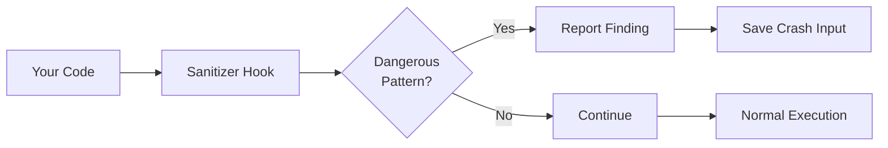

# 🛡️ Sanitizer Configuration Guide

<div align="center">

**🔒 Master Security Vulnerability Detection**

[🏠 Demo Hub](../README.md) | [📚 All Tutorials](../tutorials)

</div>

---

## 🎯 What You'll Learn

This guide covers Jazzer's powerful security sanitizers:

- ✅ Understanding sanitizers (bug detectors)
- ✅ Configuring each sanitizer type
- ✅ SQL Injection detection
- ✅ SSRF (Server-Side Request Forgery) prevention
- ✅ Path Traversal detection
- ✅ Command Injection prevention
- ✅ Deserialization vulnerability detection
- ✅ Custom sanitizer configuration

**Time Required:** 20 minutes  
**Level:** Intermediate  
**Prerequisites:** Basic fuzzing knowledge

---

## 📚 Table of Contents

1. [What Are Sanitizers?](#-what-are-sanitizers)
2. [SQL Injection Detection](#-sql-injection-detection)
3. [SSRF Prevention](#-ssrf-prevention)
4. [Path Traversal Detection](#-path-traversal-detection)
5. [Command Injection Prevention](#-command-injection-prevention)
6. [Deserialization Security](#-deserialization-security)
7. [Other Sanitizers](#-other-sanitizers)
8. [Configuration Tips](#-configuration-tips)

---

## 🔍 What Are Sanitizers?

**Sanitizers** (also called **bug detectors**) are built-in security monitors that watch your application for dangerous patterns while fuzzing.

### How They Work



### Available Sanitizers

| Sanitizer | Detects | Severity |
|-----------|---------|----------|
| SQL Injection | Malformed SQL queries | 🔴 High |
| SSRF | Unauthorized network requests | 🟡 Medium |
| Path Traversal | Directory escape attempts | 🟡 Medium |
| Command Injection | OS command injection | 🔴 High |
| Deserialization | Unsafe deserialization | 🔴 High |
| LDAP Injection | LDAP query injection | 🟡 Medium |
| XPath Injection | XPath query injection | 🟡 Medium |
| Expression Language | EL injection | 🔴 High |
| Regex Injection | ReDoS vulnerabilities | 🟡 Medium |

---

## 🗄️ SQL Injection Detection

### What It Detects

The SQL Injection sanitizer monitors database queries and detects:
- Malformed SQL syntax
- Unescaped special characters
- Injection attempts

### How It Works

```java
import com.code_intelligence.jazzer.junit.FuzzTest;

class SqlInjectionFuzzTest {
    
    @FuzzTest
    void fuzzSqlQuery(String userInput) {
        // Sanitizer automatically monitors this
        String query = "SELECT * FROM users WHERE name = '" + userInput + "'";
        
        try {
            Statement stmt = connection.createStatement();
            stmt.executeQuery(query);  // ⚠️ Monitored by sanitizer
        } catch (SQLException e) {
            // If query is malformed AND execution fails,
            // sanitizer reports SQL injection
        }
    }
}
```

### Example Detection

```java
@FuzzTest
void fuzzVulnerableQuery(String username) {
    // VULNERABLE: Direct string concatenation
    String sql = "SELECT * FROM users WHERE username = '" + username + "'";
    executeQuery(sql);
    
    // Input: ' OR '1'='1
    // Result: 🚨 SQL Injection detected!
    // Query: SELECT * FROM users WHERE username = '' OR '1'='1'
}
```

### Safe Pattern

```java
@FuzzTest
void fuzzSafeQuery(String username) {
    // SAFE: Using prepared statements
    String sql = "SELECT * FROM users WHERE username = ?";
    PreparedStatement stmt = connection.prepareStatement(sql);
    stmt.setString(1, username);
    stmt.executeQuery();
    
    // Sanitizer won't report - input is properly escaped
}
```

### Configuration

```java
// SQL Injection sanitizer is enabled by default
// No configuration needed!

// To disable (not recommended):
// -Djazzer.disabled_hooks=com.code_intelligence.jazzer.sanitizers.SqlInjection
```

---

## 🌐 SSRF Prevention

### What It Detects

Server-Side Request Forgery sanitizer monitors network connections to:
- Internal IP addresses (127.0.0.1, 10.x.x.x, 192.168.x.x)
- Local resources
- Unexpected destinations

### How It Works

```java
import com.code_intelligence.jazzer.api.BugDetectors;
import java.net.URL;
import java.net.HttpURLConnection;

class SsrfFuzzTest {
    
    @FuzzTest
    void fuzzUrlFetch(String url) {
        try {
            // Sanitizer monitors network connections
            URL targetUrl = new URL(url);
            HttpURLConnection conn = (HttpURLConnection) targetUrl.openConnection();
            conn.connect();  // ⚠️ Monitored by sanitizer
            
            // Input: http://localhost:8080/admin
            // Result: 🚨 SSRF detected!
            
        } catch (Exception e) {
            // Expected for invalid URLs
        }
    }
}
```

### Configuration with BugDetectors API

```java
import com.code_intelligence.jazzer.api.BugDetectors;

class ConfiguredSsrfTest {
    
    @FuzzTest
    void fuzzWithAllowlist(String url) {
        // Allow specific hosts
        BugDetectors.allowNetworkConnections((host, port) -> {
            // Allow external APIs
            if (host.equals("api.example.com")) return true;
            if (host.equals("cdn.example.com")) return true;
            
            // Block everything else
            return false;
        });
        
        fetchUrl(url);
    }
    
    @FuzzTest
    void fuzzWithInternalAllowed(String url) {
        // Allow localhost for testing
        BugDetectors.allowNetworkConnections((host, port) -> {
            // Allow localhost on port 8080
            return host.equals("localhost") && port == 8080;
        });
        
        fetchUrl(url);
    }
}
```

### Permissive Mode

```bash
# Allow all connections until explicitly configured
export JAZZER_SSRF_PERMISSIVE_UNTIL_CONFIGURED=1

JAZZER_FUZZ=1 mvn test
```

### Example Scenarios

```java
@FuzzTest
void fuzzExternalApiOnly(String endpoint) {
    // Configure to allow only external API
    BugDetectors.allowNetworkConnections((host, port) -> {
        return host.endsWith(".amazonaws.com") || 
               host.endsWith(".googleapis.com");
    });
    
    String url = "https://api.example.com/" + endpoint;
    httpClient.get(url);
}
```

---

## 📂 Path Traversal Detection

### What It Detects

Path Traversal sanitizer monitors file operations for:
- Directory escape attempts (`../`, `..\\`)
- Absolute paths outside allowed directories
- Symbolic link exploits

### How It Works

```java
import com.code_intelligence.jazzer.api.BugDetectors;
import java.io.File;
import java.nio.file.Files;
import java.nio.file.Paths;

class PathTraversalFuzzTest {
    
    @FuzzTest
    void fuzzFileRead(String filename) {
        try {
            // Sanitizer monitors file operations
            File file = new File("/var/app/uploads/" + filename);
            Files.readAllBytes(file.toPath());  // ⚠️ Monitored
            
            // Input: ../../etc/passwd
            // Result: 🚨 Path Traversal detected!
            
        } catch (Exception e) {
            // Expected for invalid paths
        }
    }
}
```

### Configuration

```java
import com.code_intelligence.jazzer.api.BugDetectors;
import java.nio.file.Path;
import java.nio.file.Paths;

class ConfiguredPathTraversalTest {
    
    private static final Path UPLOAD_DIR = Paths.get("/var/app/uploads");
    
    @FuzzTest
    void fuzzWithAllowedDir(String filename) {
        // Configure allowed directories
        BugDetectors.allowFileSystemOperations((path) -> {
            try {
                Path normalized = path.normalize().toAbsolutePath();
                return normalized.startsWith(UPLOAD_DIR);
            } catch (Exception e) {
                return false;
            }
        });
        
        readFile(filename);
    }
}
```

### Safe Pattern

```java
@FuzzTest
void fuzzSafeFileRead(String filename) {
    // SAFE: Validate and normalize path
    Path uploadDir = Paths.get("/var/app/uploads");
    Path requestedPath = uploadDir.resolve(filename).normalize();
    
    // Check if resolved path is within upload directory
    if (!requestedPath.startsWith(uploadDir)) {
        throw new SecurityException("Path traversal attempt");
    }
    
    Files.readAllBytes(requestedPath);
}
```

---

## ⚡ Command Injection Prevention

### What It Detects

Command Injection sanitizer monitors:
- `Runtime.exec()` calls
- `ProcessBuilder` usage
- Shell command execution with user input

### How It Works

```java
class CommandInjectionFuzzTest {
    
    @FuzzTest
    void fuzzCommand(String userInput) {
        try {
            // Sanitizer monitors command execution
            String[] cmd = {"/bin/sh", "-c", "echo " + userInput};
            Runtime.getRuntime().exec(cmd);  // ⚠️ Monitored
            
            // Input: hello; rm -rf /
            // Result: 🚨 Command Injection detected!
            
        } catch (Exception e) {
            // Expected
        }
    }
}
```

### Vulnerable Patterns

```java
@FuzzTest
void fuzzVulnerableCommand(String filename) {
    // VULNERABLE: Shell metacharacters
    String command = "cat /var/log/" + filename;
    Runtime.getRuntime().exec(command);
    
    // Input: access.log; cat /etc/passwd
    // Result: 🚨 Executes both commands!
}
```

### Safe Pattern

```java
@FuzzTest
void fuzzSafeCommand(String filename) {
    // SAFE: Use array form, no shell
    String[] command = {"cat", "/var/log/" + filename};
    Runtime.getRuntime().exec(command);
    
    // Semicolons are treated as part of filename
    // Cannot inject additional commands
}
```

### Best Practice

```java
@FuzzTest
void fuzzBestPractice(String filename) {
    // BEST: Validate input and use ProcessBuilder
    if (!filename.matches("[a-zA-Z0-9._-]+")) {
        throw new IllegalArgumentException("Invalid filename");
    }
    
    ProcessBuilder pb = new ProcessBuilder(
        "cat", 
        "/var/log/" + filename
    );
    pb.start();
}
```

---

## 🔓 Deserialization Security

### What It Detects

Deserialization sanitizer monitors:
- Java deserialization of untrusted data
- Known gadget chains
- Suspicious object types

### How It Works

```java
import java.io.*;

class DeserializationFuzzTest {
    
    @FuzzTest
    void fuzzDeserialization(byte[] data) {
        try {
            ByteArrayInputStream bis = new ByteArrayInputStream(data);
            ObjectInputStream ois = new ObjectInputStream(bis);
            
            // Sanitizer monitors deserialization
            Object obj = ois.readObject();  // ⚠️ Monitored
            
            // If dangerous classes detected:
            // Result: 🚨 Deserialization vulnerability!
            
        } catch (Exception e) {
            // Expected for malformed data
        }
    }
}
```

### Vulnerable Pattern

```java
@FuzzTest
void fuzzVulnerableDeserialize(byte[] serializedData) {
    // VULNERABLE: Deserializing untrusted data
    ObjectInputStream ois = new ObjectInputStream(
        new ByteArrayInputStream(serializedData)
    );
    Object obj = ois.readObject();
    
    // Attacker can craft payload to execute code!
}
```

### Safe Pattern

```java
@FuzzTest
void fuzzSafeDeserialize(byte[] data) {
    // SAFE: Use allowlist of classes
    ObjectInputStream ois = new ObjectInputStream(
        new ByteArrayInputStream(data)
    ) {
        @Override
        protected Class<?> resolveClass(ObjectStreamClass desc)
                throws IOException, ClassNotFoundException {
            
            // Allowlist of safe classes
            if (desc.getName().equals("com.example.SafeData")) {
                return super.resolveClass(desc);
            }
            
            throw new InvalidClassException(
                "Unauthorized deserialization attempt",
                desc.getName()
            );
        }
    };
    
    Object obj = ois.readObject();
}
```

---

## 🔧 Other Sanitizers

### LDAP Injection

```java
@FuzzTest
void fuzzLdapQuery(String username) {
    // Monitors LDAP queries
    String filter = "(uid=" + username + ")";
    dirContext.search("ou=users", filter, searchControls);
    
    // Input: *)(uid=*))(|(uid=*
    // Result: 🚨 LDAP Injection detected!
}
```

### XPath Injection

```java
@FuzzTest
void fuzzXpathQuery(String searchTerm) {
    // Monitors XPath queries
    String xpath = "//user[name='" + searchTerm + "']";
    XPath xpathObj = XPathFactory.newInstance().newXPath();
    xpathObj.evaluate(xpath, document);
    
    // Input: ' or '1'='1
    // Result: 🚨 XPath Injection detected!
}
```

### Expression Language Injection

```java
@FuzzTest
void fuzzExpressionLanguage(String expression) {
    // Monitors EL evaluation
    ExpressionFactory factory = ExpressionFactory.newInstance();
    ValueExpression ve = factory.createValueExpression(
        context, "${" + expression + "}", Object.class
    );
    ve.getValue(context);
    
    // Input: "".getClass().forName("java.lang.Runtime")
    // Result: 🚨 EL Injection detected!
}
```

### Regex DoS (ReDoS)

```java
@FuzzTest
void fuzzRegex(String pattern, String input) {
    try {
        Pattern p = Pattern.compile(pattern);
        Matcher m = p.matcher(input);
        m.find();
        
        // Detects catastrophic backtracking
        // Input pattern: (a+)+b, input: aaaaaaaaaaaaaaa!
        // Result: 🚨 ReDoS detected!
        
    } catch (PatternSyntaxException e) {
        // Expected
    }
}
```

---

## ⚙️ Configuration Tips

### Disabling Specific Sanitizers

```bash
# Disable SQL Injection sanitizer
-Djazzer.disabled_hooks=com.code_intelligence.jazzer.sanitizers.SqlInjection

# Disable multiple sanitizers
-Djazzer.disabled_hooks=com.code_intelligence.jazzer.sanitizers.SqlInjection,com.code_intelligence.jazzer.sanitizers.ServerSideRequestForgery
```

### Environment Variables

```bash
# SSRF permissive mode
export JAZZER_SSRF_PERMISSIVE_UNTIL_CONFIGURED=1

# Custom configuration
export JAZZER_CUSTOM_HOOKS=/path/to/custom/hooks
```

### Programmatic Configuration

```java
import com.code_intelligence.jazzer.api.BugDetectors;

class ConfiguredFuzzTest {
    
    static {
        // Configure SSRF allowlist
        BugDetectors.allowNetworkConnections((host, port) -> {
            return host.endsWith(".example.com");
        });
        
        // Configure path traversal allowlist
        BugDetectors.allowFileSystemOperations((path) -> {
            return path.startsWith("/var/app/uploads");
        });
    }
    
    @FuzzTest
    void fuzzWithConfig(String input) {
        // Sanitizers use configured rules
        processInput(input);
    }
}
```

---

## 🎯 Best Practices

### ✅ Do

- **Enable all relevant sanitizers** for your application
- **Configure allowlists** instead of disabling sanitizers
- **Test with realistic scenarios** to avoid false positives
- **Review findings carefully** - not all are true vulnerabilities
- **Use sanitizers with assertions** for comprehensive testing

### ❌ Don't

- **Don't disable sanitizers** unless absolutely necessary
- **Don't ignore findings** without investigation
- **Don't test with permissive mode** in production
- **Don't assume all findings are bugs** - validate each one

---

## 📊 Example: Complete Security Test

```java
import com.code_intelligence.jazzer.api.BugDetectors;
import com.code_intelligence.jazzer.junit.FuzzTest;
import com.code_intelligence.jazzer.mutation.annotation.NotNull;
import com.code_intelligence.jazzer.mutation.annotation.WithUtf8Length;

class CompleteSecurity FuzzTest {
    
    static {
        // Configure SSRF
        BugDetectors.allowNetworkConnections((host, port) -> {
            return host.equals("api.example.com") && port == 443;
        });
        
        // Configure file access
        BugDetectors.allowFileSystemOperations((path) -> {
            return path.startsWith("/var/app/uploads");
        });
    }
    
    @FuzzTest
    void fuzzUserInput(
        @NotNull @WithUtf8Length(max = 200) String username,
        @NotNull @WithUtf8Length(max = 200) String filename,
        @NotNull @WithUtf8Length(max = 1000) String sqlQuery,
        @NotNull @WithUtf8Length(max = 200) String url
    ) {
        // All security sanitizers active!
        
        // Test SQL injection
        executeSqlQuery(sqlQuery);
        
        // Test path traversal
        readFile(filename);
        
        // Test SSRF
        fetchUrl(url);
        
        // Test command injection
        runCommand(username);
    }
}
```

---

## 🚀 Next Steps

Now that you understand sanitizers:

1. **Try Live Examples** - [SQL Injection Demo](../examples/sql-injection-demo/)
2. **Learn Advanced Techniques** - [Advanced Fuzzing](advanced-techniques.md)
3. **Set Up CI/CD** - [GitHub Actions](../integrations/github-actions/)
4. **Explore More** - [All Examples](../examples/)

---

## 📚 Resources

- 📖 [Jazzer Sanitizers Source](../../sanitizers/src/main/java/com/code_intelligence/jazzer/sanitizers/)
- 🎯 [BugDetectors API Documentation](https://codeintelligencetesting.github.io/jazzer-docs/jazzer-api/com/code_intelligence/jazzer/api/BugDetectors.html)
- 💡 [Security Examples](../examples/)
- 🏠 [Demo Hub](../README.md)

---

<div align="center">

**Secure Your Code with Jazzer! 🛡️**

[⬆ Back to Top](#️-sanitizer-configuration-guide) | [🏠 Demo Hub](../README.md)

</div>
